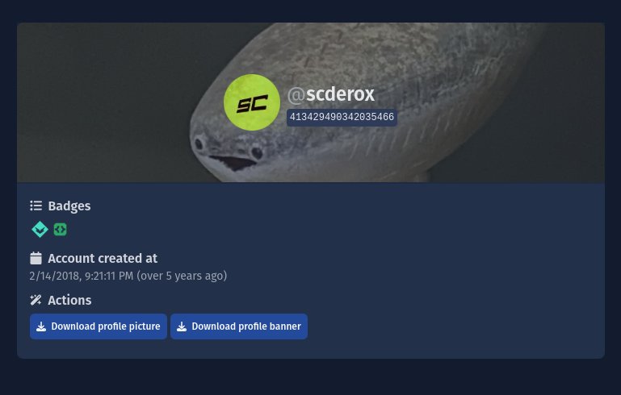

# Toolbox

The SCNX Toolbox is a set of tools designed to make your life as a professional Discord-User easier.

<IncludedInPlan data={{PRO: true, ACTIVE_GUILD: true, STARTER: true}} />

## Discord-User-Lookup {#user-lookup}

Lookup any Discord-User or Bot by their Discord-ID! Simply enter it above and see their banner, profile picture, badges
and more. To copy a User-ID, first
enable [discord developer mode](https://faq.scnx.app/discord-entwicklermodus-aktivieren/), then right-click on the user
and click on "Copy User ID".

Next, enter the ID in the [User-Lookup tool](https://scnx.app/user/tools?page=user-lookup). Click on "Fetch user" to
finish your request. You'll be shown details about the user and can download their banner and profile picture (if
applicable). Here's how the result will look like:

## Timestamp-Generator {#timestamp-generator}

Use the Timestamp-Generator to insert and times in messages on Discord. The time will be displayed in the local timezone
of the user - no more confusion with all these timezones. Simply select a time & date in
the [Timestamp-Generator tool](https://scnx.app/user/tools?page=timestamp-generator), select a format, copy the
result and paste in discord. Your time will be displayed in Discord once you send your message.

Here are all availible formats:

| Format                    | Example                             |
|---------------------------|-------------------------------------|
| Short time                | 09:52 PM                            |
| Long time                 | 9:52:29 PM                          |
| Short date                | 8/30/2023                           |
| Long date                 | August 30, 2023                     |
| Short Date/Time (default) | August 30, 2023 09:52 PM            |
| Long Date/Time            | Wednesday, August 30, 2023 09:52 PM |
| Relative time             | 3 minutes ago                       |

## SCNX Level-XP-Calculator {#level-generator}

Use the Level-XP-Calculator to calculate how much XP a user needs to reach this level in the Leveling-System of the SCNX
CustomBot. Just enter the level in
the [Level-XP-Calculator tool](https://scnx.app/user/tools?page=level-calculator), to see how much XP is required for
users to reach that level.

### Helpful tips & tricks for your Level-System

* Every user starts at Level 1.
* While you can not adjust the XP needed to get to a new level, you can change how much XP users are going to earn per
  messages, giving you essentially the power to control Level-Ups as well.
* This calculation does not give you any information about how many messages it takes to get to this level.
* The formular to calculate the required XP is the
  following: `XPNeededToLevelUp = (LevelToCalculate - 1) * 750 + ((LevelToCalculate - 1) * 500) [XP]`
* We suggest resetting XP of your server periodically, so new members can easier archive high rankings - give older,
  active members some sort of compensation in return :heart:

## SCNX GLink-Generator {#glink-generator}

So-called "GLink"s URLs are often used when referring users of SCNX to specific resources in the dashboard of their
server. To create a GLink, first visit any site of your server on scnx.app. Next, copy the full URL and
paste [GLink-Generator tool](https://scnx.app/user/tools?page=glink-generator). Copy the result and share it with
anyone - they will be able to open the same page you accessed on
their server.