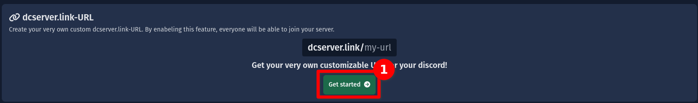

# dcserver.link

:::info Beta-Alert
This documentation is for a unreleased product that is only available for a certain number of servers on SCNX. Check
your [server settings page](https://scnx.app/glink?page=settings) on SCNX to see if you can use dcserver.link URLs.
:::

Create an unique vanity URL to your server (e.g. `https://dcserver.link/yourservername`).

<IncludedInPlan data={{PRO: true, ACTIVE_GUILD: true, STARTER: true}}
                additionalDetails={{STARTER: 'Only availible for servers with more than 50 members (without bots) on their server or with a payed plan.'}}/>

## Usage {#usage}

Create a dcserver.link to allow users to join your server by a unique vanity url, instead of a generic invite. Here's an example: Instead of users joining with the URL `https://discord.gg/WxB3z5YJh9`
users can join the (German) ScootKit Discord with `https://dcserver.link/scootkit` - this is way easier to remember.

The (verified) SCNX Bot will automatically create invites for members wanting to join with your link - there's no need to worry about expiring invites.

To view, copy or [change](#change-url) your current dcserver.link-URL, open the [server settings page](https://scnx.app/glink?page=settings) of your server on SCNX and scroll down to the "dcserver.link-URL" section.

## Setup {#setup}

Before setting up a dcserver.link URL for your server, please make sure your server either has a paid plan (no trial version) or has at least 50 members (without bots).

To get started, visit the [server settings page](https://scnx.app/glink?page=settings) of your server on SCNX. Scroll down to the "dcserver.link-URL" section and click on "Get started".

A unique URL for your server will be generated based on the name of your server and the Server-ID - you can easily change this later.

## Change URL {#change-url}
To change your dcserver.link URL, please visit [server settings page](https://scnx.app/glink?page=settings) of your server on SCNX. Scroll down to the "dcserver.link-URL" section and click on "Change link". You'll be able to enter your new URL. Once done, click on "Save" to save your changes.

Your new URL can only contain lowercase letters numbers and this character: `-`.

Please note that **URLs need to be unique** on the whole network. If a URL you want to use is already in use, you will be shown an error message. Please to [disputes](#disputes) about what you can do in such situations.

## URL disputes {#disputes}

Generally speaking, dcserver.link URLs are first-come, first-serve. We do not usually interfere in this practice. There are, however, a few exemptions:

    
Abuse or dcserver.link URLs

    If you believe that a dcserver.link URL is being used to scam or otherwise break Discord Community Guidelines,
    please report it to our staff (<a href="mailto:abuse@scnx.xyz">abuse@scnx.xyz</a>) and we'll take appropriate
    action. The URL can then no longer be
    used.

    
Small server VS. Big server

    This scenario happens when a big server (&gt;10.000 members without bots and active) with the same name want a
    dcserver.link URL that is currently being used by a small server (&lt;1.000 members). In such a case, our staff will
    examine a request on a case-by-case basis and might decide to transfer a dcserver.link URL. To start such a
    request <a
    href="https://scnx.app/help">contact our staff</a>.

    
Trademark infringements

    If a dcserver.link URL infringes on your trademarks, please contact our legal team (<a
    href="mailto:legal@scootkit.net">legal@scootkit.net</a>) with a legal request for removal. After that request went
    through (and the content was removed),
    you might be able to claim the dcserver.link URL by responding to the confirmation E-Mail (optional).

    
Inactive / deleted servers on SCNX

    When a server is , their dcserver.link URL will be deleted permanently. This does not
    happen when a server is deactivated / flagged on SCNX - in such cases, the URL will just become inactive, but will
    still be claimed. Expired Starter-Plans do not affect the usability of dcserver.link URLs.

