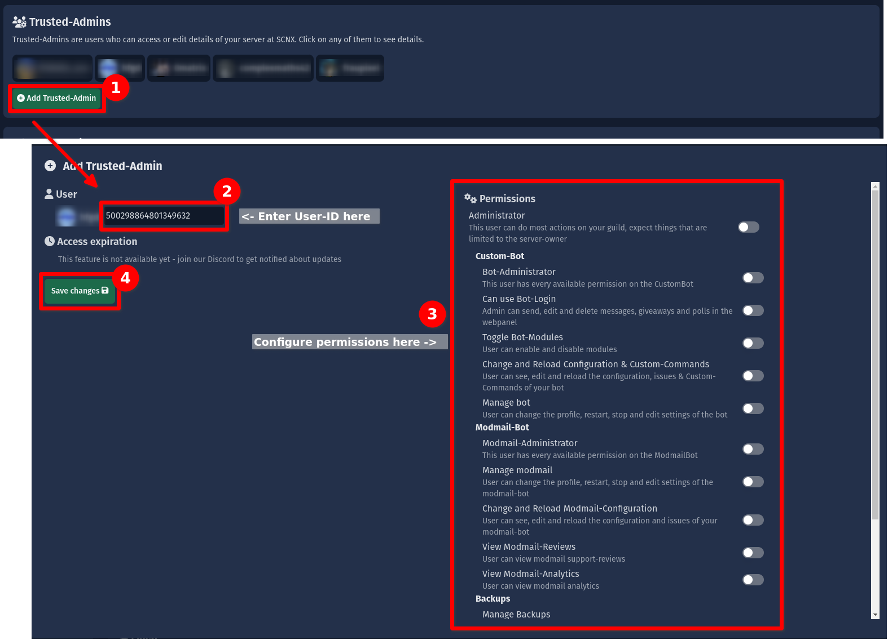

# Trusted Admins

Owners can give their admins access to certain resources on SCNX easily using the Trusted Admins feature on SCNX.

<IncludedInPlan data={{STARTER: true, PRO: true, ACTIVE_GUILD: true}} />

## Setup {#setup}

:::caution
Only grant Trusted-Admin-Permissions to users you fully trust - they will be able to interact with SCNX in your name.
Please review the [section about this feature](https://faq.scnx.app/scnx-nutzungsbedingungen/#trusted-admins) in
our [Terms of Service](https://sc-net.work/scnx-tos).
:::
:::info
To add a new user as a Trusted-Admin, please make sure they have logged in into SCNX at least once - you can send them
this link to log-in: [https://scnx.app/auth/login](https://scnx.app/auth/login). Once they have confirmed that they have
logged into SCNX, you can continue with this guide.
:::

To add a new Trusted-Admin, visit your [server settings page](https://scnx.app/glink?page=settings) in your SCNX
Dashboard and scroll to the "Trusted-Admins" section. Next, click on "Add Trusted-Admin" to show the
Trusted-Admin-Modal. Here you can enter the Discord-ID of the Trusted-Admin you want to add and
configure [their permissions](#permissions) (please review the [permissions](#permissions) section first!). Once done,
save the changes to grant access.

## Manage {#manage}

To change the permissions of a Trusted-Admin, simply open
the [server settings page](https://scnx.app/glink?page=settings) in your SCNX
Dashboard and scroll to the "Trusted-Admins" section and click on your Trusted-Admin. The Trusted-Admin-Modal will show
up - here you can change [their permissions](#permissions). To save changes, please click on "Save changes". To remove
the access of a Trusted-Admin, click on "Remove Access" in the Trusted-Admin-Modal.

## Permissions {#permissions}

The following permissions can be given via Trusted-Admin-Permissions:

| Permission                                                       | Explanation                                                                                                                                                                      |
|------------------------------------------------------------------|----------------------------------------------------------------------------------------------------------------------------------------------------------------------------------|
| Administrator                                                    | This user can do most actions on your guild, expect things that are limited to the server-owner.                                                                                 |
| **Custom-Bot**: Bot-Administrator                                | This user has every available permission on the CustomBot.                                                                                                                       |
| **Custom-Bot**: Can use Bot-Login                                | This user can send, edit and delete messages and certain integrated modules in the webpanel Login-As-A-Bot-features.                                                             |
| **Custom-Bot**: Toggle Bot-Modules                               | This user can enable and disable modules of the CustomBot.                                                                                                                       |
| **Custom-Bot**: Change and Realod Configuration / Custom Command | This user can see, edit and reload the configuration, issues and Custom-Commands of your bot. This includes the possibility to reset configuration-files to their default value. |
| **Custom-Bot**: Manage Bot                                       | This user can change the profile, restart, stop and edit settings of the bot.                                                                                                    |
| **Modmail-Bot**: Modmail Administrator                           | This user has every available permission on your Modmail-Bot.                                                                                                                    |
| **Modmail-Bot**: Manage Modmail                                  | This user can change the profile, restart, stop and edit settings of the Modmail-bot                                                                                             |
| **Modmail-Bot**: Change & Reload configuration                   | This user can view, edit and reload the configuration and issues of your Modmail-Bot.                                                                                            |
| **Modmail-Bot**: View Modmail-Reviews                            | This user can view modmail support-reviews and view resulting reports.                                                                                                           |
| **Modmail-Bot**: View Modmail-Analytics                          | This user can view modmail analytics.                                                                                                                                            |
| **Backups**: Manage Backups                                      | This user can create, export & delete backups and change the settings of them.                                                                                                   |
| **Analytics**: View & use analytics                              | This user can view and use your server's analytics.                                                                                                                              |
| **Integrations**: View & edit integrations                       | This user can view and edit any features of any integration. They can not add new integrations.                                                                                  |

Additionally, every Trusted-Admin has a **baseline of permissions**:

* View every setting (and change some) in the [server settings](https://scnx.app/guild/489786377261678592/settings) tab
* View Metadata about your server (like name, icon, owner, ...)
* View purchase data about your server (this includes transaction history, but never personal data of subscriptions)
* Upgrade or set-up subscriptions for your server
* Top-Up AI-Credits on your server

Trusted Admins **never can**:

* enable new products (like Custom-Bot, Modmail-Bot, Analytics, …) on your server
* change the token of any bot created on SCNX
* add, change permissions or remove Trusted-Admins from your server - only the server owner can do that
* delete products from your server or remove the server from SCNX
* purchase products in your name or with your payment methods
* consent to our staff to run potentially destructive actions

Trusted-Admins can no longer access your server when they leave it (or get removed).

## Troubleshooting {#throubleshooting}

When entering my User-ID, SCNX shows me a "Could not fetch user error"

The Discord-ID of the user you are trying to add is invalid. User-IDs consist of only numbers and are not the same as tags, discriminators, or usernames. To obtain a Discord-ID, follow this 
<a href="https://support.discord.com/hc/en-us/articles/206346498-Where-can-I-find-my-User-Server-Message-ID-">Discord Guide</a>.

When I try to add a Trusted-Admin, SCNX shows me a "This user never logged into SCNX…" error 

This means that this user never logged in into SCNX before. 
<ul>
    <li>Send them
this link to log-in: <a href="https://scnx.app/auth/login">https://scnx.app/auth/login</a>. Once they have confirmed that they have
logged into SCNX, please try again.</li>
<li>Let them verify that they are logged in into the correct account and let them log-out and try again.</li>
</ul>
Ultimately, you can not force another use to log into SCNX. There is no way to add a user to SCNX without their prior login.

My Trusted Admin is shown a "No permissions on this server" error in the dashboard

Please make sure you have assigned the right <a href="#permissions">permissions</a> to your Trusted-Admin. You can easily edit the permissions of the Trusted-Admin by following this <a href="#manage">section about managing Trusted-Admins</a>.

My Trusted-Admin can not set up a Custom-Bot, Modmail-Bot, …

Trusted Admins can not run sensitve actions like enabling or deleting products. Please review the <a href="#permissions">permissions section</a>  to learn more about these restrictions. They will be able to edit the products after the Server-Owner enables it.

My Trusted-Admin can not find my server in their server list

<ul>
    <li>Please make sure the user is signed in with the same account you have granted access to</li>
   <li>Ask them to refresh the Server-List using the "Refresh data"-Button on the bottom of the page</li>
    <li>Make sure the Trusted-Admin is a member of your server - only server members can be Trusted-Admins.</li>
    </ul>

