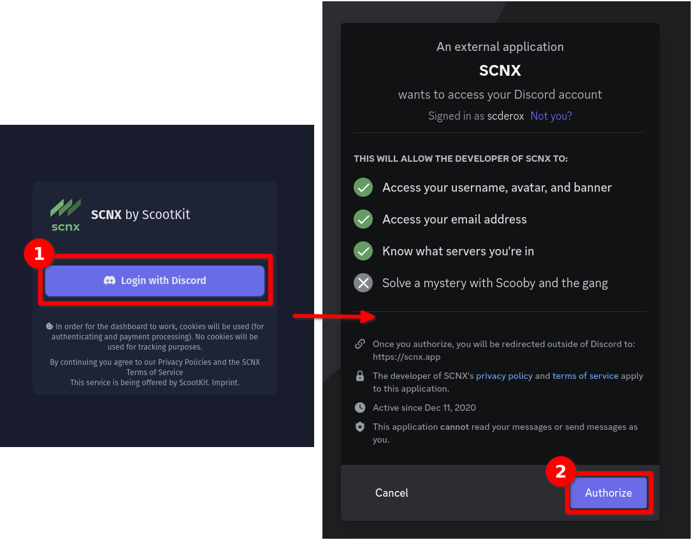
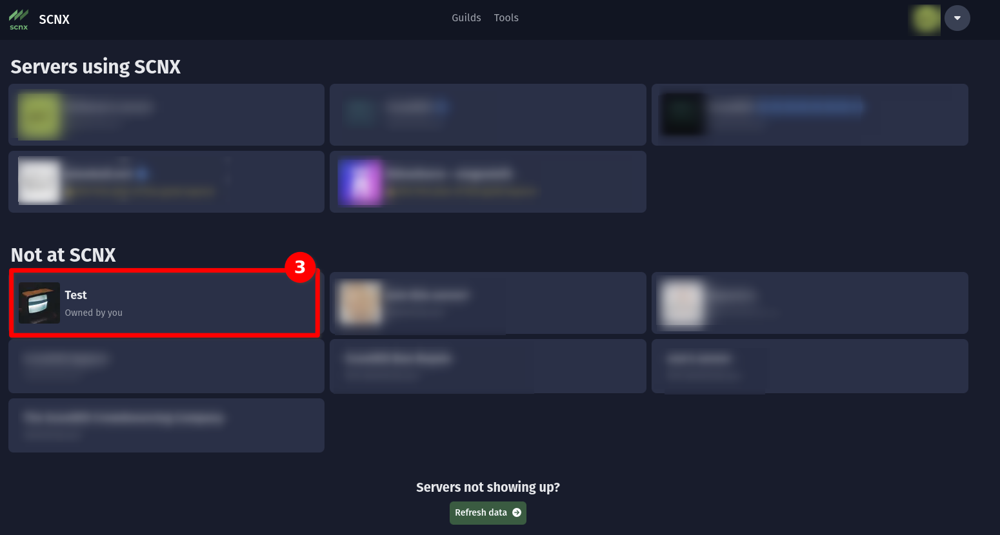
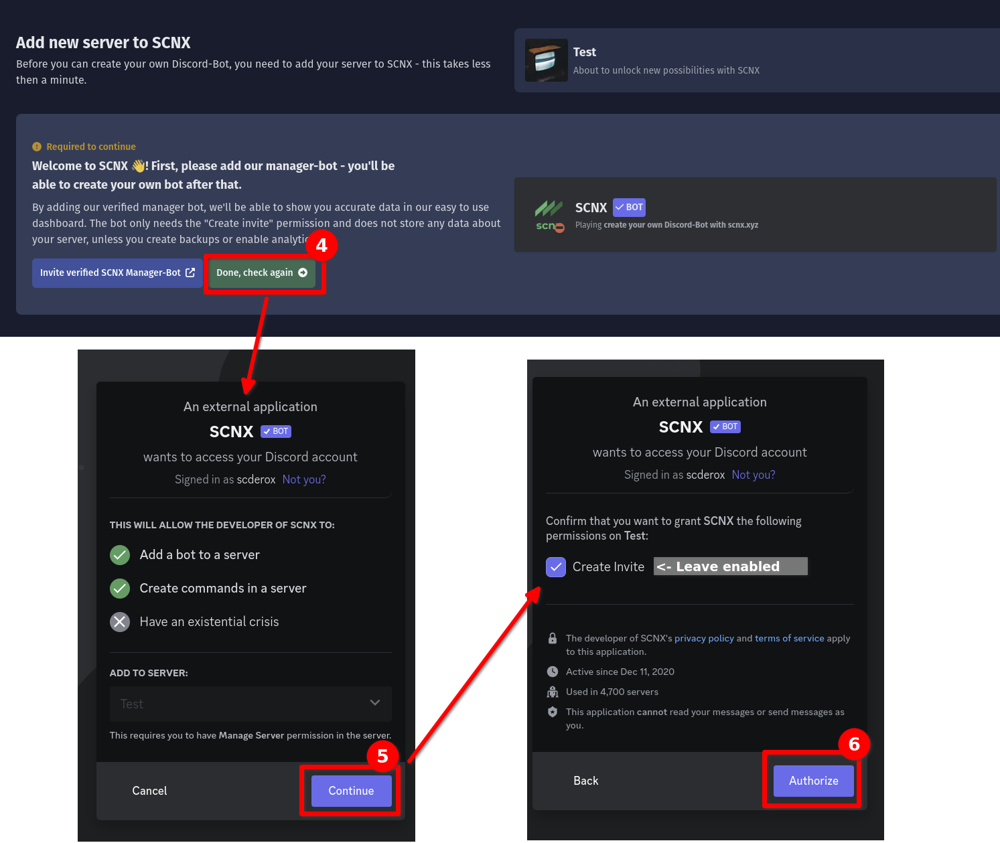
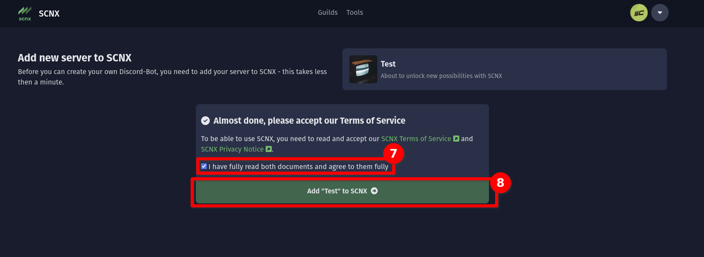
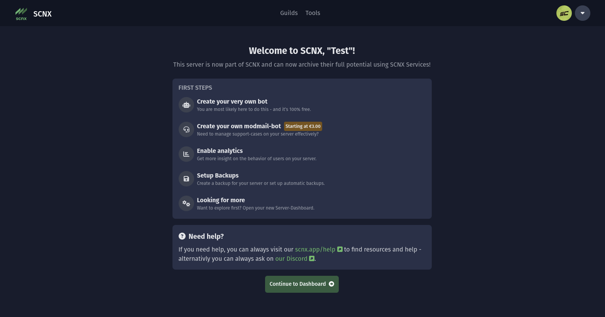

# Get started on SCNX

Getting started on SCNX requires a quick setup, but you'll be able to create your own Discord-Bot right after that.

## 0. What is SCNX (not)

SCNX is **desinged for communities**. You can __**not create a public bot**__ on SCNX, instead you can create a bot for
*your* server that you can completely customize.

## 1. Log in to SCNX {#step-1}

:::info
To use SCNX, you agree to our [SCNX Terms of Service](https://sc-net.work/scnx-tos) and other legal documents. Please
make sure to read them before continuing :wink:
:::

Head over to [scnx.app](https://scnx.app) to get started. You'll be asked to login with your Discord-Account. To do
that, just click on the "Login with Discord" button. If you're wondering why we need access to certain data of you ("
scopes"), you can find the answere [in our FAQ](./scnx/account-and-billing/faq#discord-access).

## 2. Add the server to SCNX {#step-2}

Next, you'll see the [server overview page](https://scnx.app/user/guilds). Here you can see all servers you have access
to. Select the server you want to set up SCNX on.

:::tip Can't find your server?
Please make sure you are the **owner of a server** in order to add it to SCNX. If not, ask the owner to set up SCNX and
give you [Trusted Admin Permissions](scnx/guilds/trusted-admins). If you've recently created a server and it is not
visible in the dashboard, refresh the server list using the "Refresh data" button on the bottom of the page.
:::

## 3. Add the SCNX Bot to your server {#step-3}

Next, you'll need to add the SCNX Bot to your server. This bot allows our Dashboard to work and is able
to [create server backups](./scnx/guilds/backups), [show analytics into your server](./scnx/guilds/analytics) and
more (all these features are opt-in - no data gets stored by default). This bot is required to work.

To invite the SCNX Bot, click on the "Invite verified SCNX Manager-Bot" in your dashboard and confirm that you want to
add the bot. Please make sure to leave the "Create invite" permission enabled (this is required if you want to use
SCNX).

Next, return to SCNX and click on "Done, check again" to continue the setup process.

## 4. Accept our Terms of Service & Privacy Policy {#step-4}

To finish setup, you'll need to to agree to our [SCNX Terms of Service](https://sc-net.work/scnx-tos)
and [SCNX Privacy Note](https://sc-net.work/scnx-privacy). These documents contain important information about how you
can use SCNX and how we will process data (tl;dr: We only process data to provide the service).

## 5. You are done {#step-5}

Your server has been successfully added to SCNX :tada:
You can now start by [creating your own bot](custom-bot) or [modmail-bot](modmail) or explore all features on your own -
our [documentation](/) & [staff](https://scnx.app/help) on our [Discord](https://sc-net.work/dc) is always here to help.

